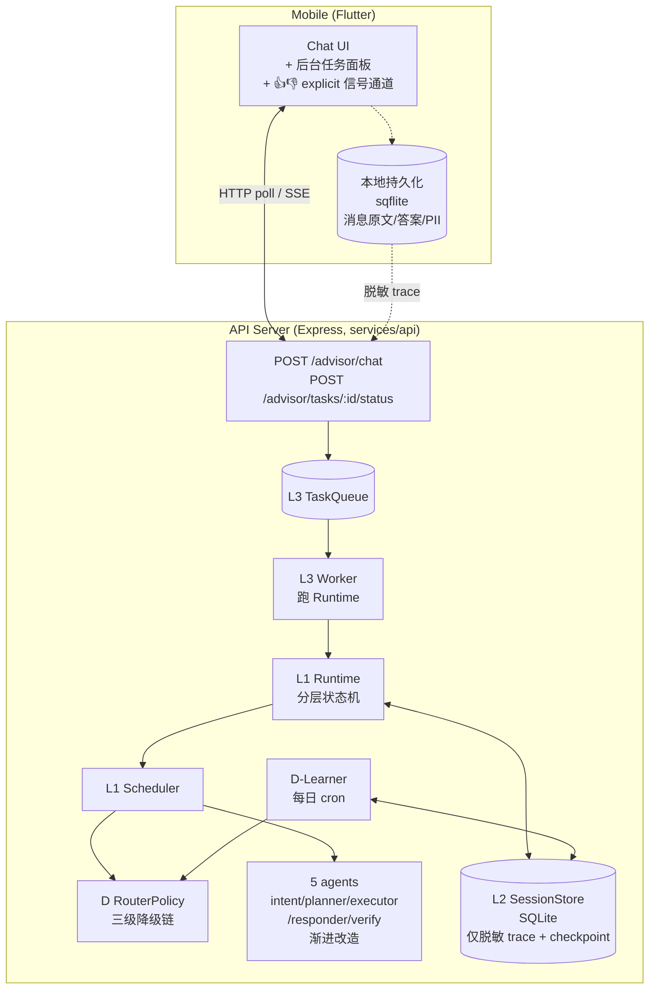
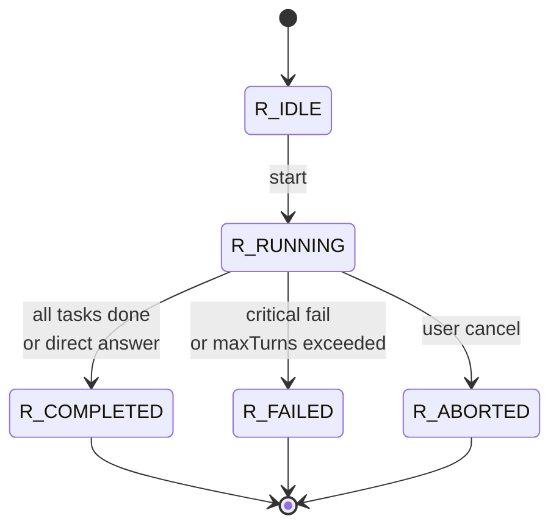
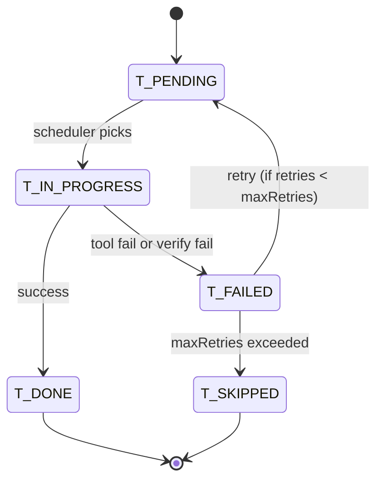

# Self-Evolving Advisor Agent 架构设计

> 状态：草案（待 user review）
> 作者：当前会话
> 日期：2026-05-19
> 相关上游文档：`prd.md`（当前 agentloop 结构梳理与排障手册）、`progress.md`（项目进展真相源）
> 相关下游文档：implementation plan（待生成，由 writing-plans skill 产出）

## 1. 概述

### 1.1 背景

当前 advisor 已落地完整的 `intent → planner → executor → responder → verify` 流水线（详见 `prd.md` 第 38-60 行），但有三个本质局限：

1. **一次性流水线**：每次请求执行一次后即结束，planner 看不到 executor 真实结果就无法回头改决策；verify 失败只能 fallback 一次。
2. **路由策略硬编码**：intent gate 阈值、`forcePlanForSearch` 关键词、工具回退顺序等都写死在代码里，无法基于真实流量数据自动调整。
3. **无可恢复执行**：长任务（30 秒以上）只能让用户在 mobile 端干等，超时即放弃，无法后台续跑。

### 1.2 目标

把 advisor 升级为**可演化的 runtime + 可自适应的 router**：

- **R1（Runtime 演化）**：从"一次性流水线"升级为带分层状态机、可恢复、可多轮、可后台执行的持续 loop。
- **R2（Router 自适应）**：路由策略基于真实流量信号自动学习与更新，覆盖 intent 阈值、搜索超时、工具优先级等关键决策点。

### 1.3 范围（本设计涵盖）

- L1：单请求内多轮 in-process loop（无持久化）
- L2：会话级持久化 + D 学习器
- L3：跨请求后台执行 + 通知通道
- D 路由器：信号采集 + 在线滚动统计 + 离线 batch 学习 + 策略表灰度
- 三级降级链：人工开关 > D 策略 > hard-coded 规则
- 全部以**渐进迁移**方式落地：现有业务规则全部保留，不重写

### 1.4 非目标（本设计不涵盖）

以下能力虽与 self-evolving 相关，但本轮**明确不做**，等本设计落地后视情况另立设计：

- A 方向：经验记忆与反思（Reflexion / MemGPT 风格）
- B 方向：Prompt / Pipeline 自动优化（DSPy / Trace / Promptbreeder 风格）
- C 方向：工具/技能自生长（Voyager / AgentSkills 风格）
- F 方向：多角色协作与互炼（CAMEL / AgentVerse 风格）

## 2. 关键术语

| 术语 | 定义 |
|---|---|
| **Runtime** | 一次 advisor 请求对应的运行时实例，承载 L1 状态机的整体生命周期 |
| **Task** | Runtime 内由 planner 产生的子任务（当前 1-4 个），是 L1 调度的基本单元 |
| **Turn** | 一次"plan → execute → respond → verify"的迭代，一个 Runtime 内可有多个 Turn（由 maxTurns 控制） |
| **Checkpoint** | Runtime/Task 在 L2 SessionStore 中的状态快照，按 Task 边界落盘 |
| **Trace** | Runtime 执行过程中产生的脱敏可观测信号集合（耗时、tool 状态、verify 结果等） |
| **Policy** | D 路由器输出的策略表，定义在何种条件下采用何种决策 |
| **PolicyVersion** | 策略表的版本号，支持人工锁定（pinned）与自动升级（auto） |
| **D-Learner** | 离线批处理进程，从 Trace 学习并产出新版 Policy |
| **Scheduler** | L1 状态机的调度器，决定下一步执行哪个 agent / 哪个 Task |
| **三级降级链** | 决策时优先级：① 人工硬开关（ADVISOR_*）> ② D Policy > ③ 现有 hard-coded 规则 |

## 3. 架构总览

### 3.1 三阶段架构总图



### 3.2 与现有 advisor 的契约保留

**对外 API 完全向后兼容**。`POST /advisor/chat` 当前的请求/响应 schema 在 L1 阶段不变，仅**新增可选字段**：

请求新增可选字段：
- `sessionId?: string` —— 会话 ID（E.2 起生效；不传时按一次性请求处理）
- `clientContext?: { messageLengthBucket?: 'short'|'medium'|'long' }` —— 客户端脱敏 trace 字段

响应新增可选字段（E.3 起）：
- `taskId?: string` —— 后台任务 ID（仅在响应 status=202 时返回）
- `status?: 'completed' | 'background'` —— 任务状态

新增 endpoint（E.3）：
- `GET /advisor/tasks/:taskId/status` —— 查询后台任务状态
- `GET /advisor/tasks/:taskId/result` —— 获取后台任务最终结果

### 3.3 三阶段分期交付

| 阶段 | 范围 | 周期估算 | 上线意味着 |
|---|---|---|---|
| **Phase E.1** | L1 in-process loop + D RouterPolicy 内存版 + V1/V4/V8 可调 | 1-1.5 周 | "重链路误入降低 / verify pass 率提升"可量化 |
| **Phase E.2** | L2 SessionStore（SQLite）+ Checkpoint + D-Learner 离线版 + V3/V5/V6 加入；mobile explicit 信号 UI 通道 | 1-1.5 周 | "跨请求记忆 + D 真正自学习"上线 |
| **Phase E.3** | L3 TaskQueue + Worker + Notifier（N1 轮询 → N2 SSE）+ mobile 后台任务面板 | 2-2.5 周 | 异步长任务可用 |

每阶段独立可发布，闸门未通过则停在该阶段不进下一阶段。详见 §10 与 §11。

## 4. L1 状态机设计

### 4.1 Runtime 状态机（顶层生命周期）



| 状态 | 含义 |
|---|---|
| `R_IDLE` | Runtime 已创建但未启动 |
| `R_RUNNING` | 至少一个 Task 处于 IN_PROGRESS 或 PENDING |
| `R_COMPLETED` | 所有 Task 处于 DONE 或 SKIPPED，最终回答已生成 |
| `R_FAILED` | 出现致命错误（如所有工具均不可用）或 turn 数达上限仍未收敛 |
| `R_ABORTED` | 用户主动取消（mobile 端停止按钮）或上游中断 |

**关键参数**：
- `maxTurns`：默认 3（环境变量 `ADVISOR_MAX_TURNS`），一个 Turn = 一次 planner→executor→responder→verify 迭代
- `runtimeTimeoutMs`：默认 60000（环境变量 `ADVISOR_RUNTIME_TIMEOUT_MS`），整体硬超时上限

### 4.2 Task 状态机（子任务生命周期）



| 状态 | 含义 |
|---|---|
| `T_PENDING` | 任务已被 planner 产出，等待 Scheduler 调度 |
| `T_IN_PROGRESS` | 正在 executor 执行 |
| `T_DONE` | 任务完成且结果可用（含 verify 通过） |
| `T_FAILED` | 执行失败或 verify 不通过 |
| `T_SKIPPED` | 重试次数耗尽，标记跳过（不影响其他 Task 与最终回答合成） |

**关键参数**：
- `maxTasks`：默认 4（环境变量 `ADVISOR_MAX_TASKS`），单个 Runtime 内 Task 数量上限
- `maxRetries`：默认 1（环境变量 `ADVISOR_TASK_MAX_RETRIES`），单个 Task 失败后的重试次数
- `taskTimeoutMs`：复用现有 `ADVISOR_SEARCH_TOOL_TIMEOUT_MS`（默认 15000）

### 4.3 Scheduler 职责

Scheduler 是状态机的调度器，按以下规则推进：

1. **入口**：接到 `chat()` 请求 → 创建 Runtime（R_IDLE）→ 触发 `start` 事件 → 进入 R_RUNNING
2. **Turn 推进**：在 R_RUNNING 内执行：intent → planner（产出 Tasks）→ 循环调度 Tasks 直到全部 T_DONE 或 T_SKIPPED → responder → verify
3. **Task 调度策略**：按 planner 输出顺序串行调度（一期不引入并发，避免速率限制问题）
4. **失败处理**：
   - Task 失败 + 仍有重试次数 → 回到 T_PENDING（执行 D 决定的"是否换工具/换 query"）
   - Task 失败 + 重试耗尽 → T_SKIPPED，记录原因，继续其他 Task
   - 致命错误（如全部 LLM provider 失败）→ Runtime 直接 R_FAILED
5. **多轮触发条件**（决定是否进入下一 Turn 而不是直接 R_COMPLETED）：
   - verify 失败且当前 turn < maxTurns
   - executor 全部 T_SKIPPED 且 D 判定"应该换策略再试"
6. **退出条件**：
   - 所有 Task 处于 T_DONE/T_SKIPPED 且 responder 产出可用答案 + verify 通过（或 D 判定可跳过）→ R_COMPLETED
   - 任一条件超时 / 致命错误 → R_FAILED
   - 用户取消 / 上游断开 → R_ABORTED

### 4.4 与现有 5 个 agent 的适配协议

**改造原则**：现有 agent 不重写，仅在外部包装一层"返回 next action"接口。每个 agent 改为：

```typescript
interface AgentResult<T> {
  data: T;
  nextAction:
    | { kind: 'continue' }                  // 正常推进到下一阶段
    | { kind: 'retry_task'; taskId: string }
    | { kind: 'replan' }                     // 触发 planner 重新规划
    | { kind: 'abort'; reason: string }
    | { kind: 'done'; finalAnswer: string };
  trace: AgentTrace;                         // 脱敏的可观测信号
}
```

Scheduler 读 `nextAction` 决定下一步，不再由 agent 内部直接 chain 到下一个。

**改造工作量**：5 个 agent 文件分别加 wrapper（约 20-30 行/文件），不破坏现有 prompt 与业务逻辑。

### 4.5 错误分类

| 终态 | 触发条件 | mobile 显示 |
|---|---|---|
| `R_COMPLETED` | 正常完成 | 答案展示 |
| `R_FAILED` | 业务失败（工具全挂、解析失败、maxTurns 仍不收敛） | "暂时无法回答，请稍后重试" + 详情按钮（开发态可见 trace） |
| `R_ABORTED` | 用户主动取消 | 静默（不弹错误） |

## 5. L2 SessionStore 设计

### 5.1 选型

- **E.1/E.2**：SQLite（`better-sqlite3` 同步驱动，零运维，单文件，足以支撑单进程 100 QPS）
- **E.3 评估**：若 worker 多进程并发写需求出现，切 Postgres

环境开关：
```bash
ADVISOR_SESSION_STORE=sqlite     # sqlite | postgres | memory
ADVISOR_SESSION_STORE_PATH=./var/advisor.db
```

`memory` 模式用于单元测试与 E.1 阶段过渡。

### 5.2 Schema（仅服务端持有，全部为脱敏字段）

```sql
-- 会话主表
CREATE TABLE advisor_sessions (
  session_id      TEXT PRIMARY KEY,
  user_id         TEXT NOT NULL,             -- 不包含 PII，应为 mobile 端生成的随机 ID
  created_at      INTEGER NOT NULL,
  last_active_at  INTEGER NOT NULL,
  message_count   INTEGER NOT NULL DEFAULT 0
);

-- Runtime 主表（一次请求一条）
CREATE TABLE advisor_runtimes (
  run_id          TEXT PRIMARY KEY,
  session_id      TEXT NOT NULL,
  started_at      INTEGER NOT NULL,
  ended_at        INTEGER,
  terminal_state  TEXT,                       -- R_COMPLETED | R_FAILED | R_ABORTED
  total_turns     INTEGER NOT NULL DEFAULT 0,
  total_tasks     INTEGER NOT NULL DEFAULT 0,
  message_length_bucket TEXT,                 -- short | medium | long
  policy_version  TEXT,                       -- D 策略版本
  FOREIGN KEY (session_id) REFERENCES advisor_sessions(session_id)
);

-- Task 详情表（每个 Task 一条）
CREATE TABLE advisor_tasks (
  task_id         TEXT PRIMARY KEY,
  run_id          TEXT NOT NULL,
  task_index      INTEGER NOT NULL,
  terminal_state  TEXT NOT NULL,              -- T_DONE | T_SKIPPED | T_FAILED
  need_search     INTEGER NOT NULL,           -- 0 | 1
  tool_used       TEXT,                       -- bailian | tavily | x | none
  tool_result     TEXT,                       -- success | fail | empty
  duration_ms     INTEGER NOT NULL,
  retry_count     INTEGER NOT NULL DEFAULT 0,
  keyword_category TEXT,                      -- 主分类标签（取命中权重最高的一个，如 weather / tech / pet）；冷启动期可为 NULL
  FOREIGN KEY (run_id) REFERENCES advisor_runtimes(run_id)
);

-- 阶段级 trace（与 prd.md 现有日志点位对齐）
CREATE TABLE advisor_stage_traces (
  trace_id        TEXT PRIMARY KEY,
  run_id          TEXT NOT NULL,
  stage           TEXT NOT NULL,              -- intent | planner | executor | responder | verify
  duration_ms    INTEGER NOT NULL,
  outcome         TEXT NOT NULL,              -- pass | fail | skip
  FOREIGN KEY (run_id) REFERENCES advisor_runtimes(run_id)
);

-- D Policy 表（学习器输出）
CREATE TABLE advisor_policies (
  version         TEXT PRIMARY KEY,           -- 形如 v20260519-0400
  created_at      INTEGER NOT NULL,
  scope           TEXT NOT NULL,              -- intent_threshold | tool_priority | verify_skip | ...
  conditions_json TEXT NOT NULL,              -- 命中条件（如 keyword_category + message_length_bucket）
  actions_json    TEXT NOT NULL,              -- 决策动作（如 force_plan=true / tool_order=["tavily","bailian"]）
  rollout_pct     INTEGER NOT NULL DEFAULT 0  -- 灰度比例 0-100
);

-- L3 后台任务表（E.3 引入）
CREATE TABLE advisor_background_tasks (
  task_id         TEXT PRIMARY KEY,
  session_id      TEXT NOT NULL,
  run_id          TEXT,
  status          TEXT NOT NULL,              -- queued | running | completed | failed | aborted
  created_at      INTEGER NOT NULL,
  updated_at      INTEGER NOT NULL,
  result_ready    INTEGER NOT NULL DEFAULT 0  -- 0 | 1
);
```

### 5.3 写入时机

- 每个 Task 进入终态（T_DONE / T_SKIPPED / T_FAILED）→ 写 `advisor_tasks` + 关联 stage trace
- Runtime 进入终态 → 更新 `advisor_runtimes`
- Session 更新 `last_active_at` 与 `message_count`

**保留策略**：默认 90 天滚动清理（环境变量 `ADVISOR_TRACE_RETENTION_DAYS=90`）。`advisor_policies` 不清理（用于审计）。

### 5.4 读取与续跑（E.2 + E.3）

- 接到请求 → 若带 `sessionId` 且 SessionStore 有记录 → 读最近 N 条 Runtime 的 trace summary，作为 planner 的上下文提示
- L3 worker 重启 → 扫描 `advisor_background_tasks.status IN ('queued', 'running')` → 续跑

### 5.5 隐私白名单（绝对边界）

**mobile→server 上报 trace 时，仅允许携带以下字段**：

| 字段 | 类型 | 示例 |
|---|---|---|
| `sessionId` | 字符串（mobile 生成随机 UUID） | `s_a1b2c3d4` |
| `messageLengthBucket` | `short` / `medium` / `long` | `short` |
| `userCancelled` | 布尔 | `true` |
| `userExplicitFeedback`（E.2+） | `helpful` / `not_helpful` / `regenerate_requested` | `helpful` |

**绝对禁止上报**：消息原文、答案原文、URL 列表、电话号码 / 邮箱 / 用户名等 PII、设备指纹。

实施保障：mobile 侧在 `AdvisorChatRepository` 增加单元测试，断言上报 body 中不出现"消息原文/答案原文"的子串。

## 6. D 路由器设计

### 6.1 信号采集（一期：仅隐式信号）

| 信号 | 来源 | 用途 |
|---|---|---|
| 阶段耗时分位 | `advisor_stage_traces.duration_ms` | 学习超时阈值（V4） |
| Tool 命中率 / 失败率 | `advisor_tasks.tool_used + tool_result` | 学习工具优先级（V3） |
| Verify pass / fail 率 | `advisor_stage_traces.stage='verify'.outcome` | 学习 verify 启停（V6） |
| 重问率 | 同 sessionId 5 分钟内重复发问（mobile 标记 + server 关联） | 学习 intent 阈值（V1） |
| 关键词分类命中分布 | `advisor_tasks.keyword_category` | 学习关键词权重（V1） |
| 用户取消率 | `advisor_runtimes.terminal_state='R_ABORTED'` | 综合健康指标 |

**E.3 之后增加**（不在本设计范围）：
- `userExplicitFeedback`（👍👎/重新回答）→ V1/V3/V6 权重加成
- LLM-as-judge 离线打分 → V6/V7 权重加成

### 6.2 决策点（D 在状态机的哪些位置被调用）

| 决策点 | 触发位置 | 控制变量 | 阶段 |
|---|---|---|---|
| `routeIntent` | intent agent 完成后，决定是否进重链路 | V1 | E.1 |
| `selectToolOrder` | executor 调用工具前 | V3 | E.2 |
| `setSearchTimeout` | executor 启动工具调用 | V4 | E.1 |
| `chooseTaskQuery` | 多任务场景下决定 query 粒度 | V5 | E.2 |
| `shouldSkipVerify` | responder 完成后 | V6 | E.2 |
| `setMaxTurns` | Runtime 启动时 | V8 | E.1 |

每个决策点的实现签名：
```typescript
type RouterDecisionInput = {
  signal: RuntimeSignal;   // 当前 Runtime 已知的脱敏 trace
  defaults: HardCodedDefault; // 现有 hard-coded 规则的默认值
};

type RouterDecision<T> =
  | { source: 'human_override'; value: T; reason: string }       // ① 人工开关命中
  | { source: 'd_policy'; value: T; policyVersion: string }      // ② D 策略命中
  | { source: 'default'; value: T };                              // ③ hard-coded 兜底
```

### 6.3 在线滚动统计（实时影响硬触发）

进程内维护以下滚动窗口（默认窗口 5 分钟，环境变量 `ADVISOR_ROLLING_WINDOW_MS=300000`）：

- `recent_tool_failure_rate`：最近 5 分钟工具失败率
- `recent_verify_fail_rate`：最近 5 分钟 verify 失败率
- `recent_p95_duration`：最近 5 分钟 P95 总耗时

**用途**：当某指标突破硬阈值（如 `recent_tool_failure_rate > 0.5`）→ 立即触发降级（如降级到 stub answer + 告警）。

这部分**不依赖 SessionStore 持久化**，进程重启即重新计算（保守起见）。

### 6.4 关键词分类标签的归属规则

为消除 "一个 query 命中多个关键词分类" 时的歧义，统一规则：

- 每个关键词配置 `(keyword, category, weight)` 三元组（如 `("下雨", "weather", 1.0)`）
- 命中多个时取 **weight 总和最高的 category** 作为主分类
- 全部未命中时 → `keyword_category = NULL`，D 在该决策点跌到 hard-coded 默认
- 关键词分类配置由人工维护，存于 `services/api/src/modules/advisor/runtime/keyword_categories.ts`（一期硬编码 + 后续考虑配置化）

### 6.5 离线 batch learner（每日 cron）

**调度**：环境变量 `ADVISOR_D_LEARNER_CRON="0 4 * * *"`（每天凌晨 4 点）。

**输入**：过去 N 天的 `advisor_runtimes` + `advisor_tasks` + `advisor_stage_traces`（默认 N=7）。

**学习算法**（E.2 一期，简单稳健，不引入复杂 ML）：

每个 V 维度对应一个独立的统计学习器：

1. **V1 intent 阈值与关键词权重**：
   - 按 `keyword_category × messageLengthBucket` 分组
   - 对每组计算"走重链路命中率"（即重链路结果被 responder 实际使用的比例）
   - 命中率 > 80% → policy: `force_plan=true`；命中率 < 30% → policy: `force_plan=false`
2. **V3 工具优先级**：
   - 按 `keyword_category` 分组
   - 按 `tool_used × tool_result` 计算每工具的成功率
   - 输出按成功率降序的 `tool_order: ["tavily","bailian","x"]`
3. **V4 搜索超时**：
   - 统计所有 tool 调用的耗时 P95
   - 输出 `timeout_ms = max(5000, P95 * 1.5)`，向上取整到 1000ms
4. **V5 query 粒度**：
   - 冷启动：当前所有 query 都用 `originalMessage`，没有对照样本
   - E.2 上线后**强制对 5% 流量灰度采用 task-level query**（无论 D 是否启用，作为"探索动作"）以收集对照样本
   - 收满 ≥ 200 条对照样本（每 category）后，D-Learner 才开始学习此维度
   - 比较"任务级 query"与"原始 message query"两组的成功率
   - 若任务级在某 keyword_category 显著优于原始 → policy: `query_granularity=task_level`
5. **V6 verify 启停**：
   - 按 `keyword_category × messageLengthBucket` 分组
   - 计算 verify 改写率（verify 真正修改 responder 输出的比例）
   - 改写率 < 5% → policy: `skip_verify=true`
6. **V8 maxTurns**：
   - 统计实际收敛 turn 数分布
   - 输出 `maxTurns = P95(actual_turns)` 上限 5、下限 2

**输出**：写入 `advisor_policies` 表，新版本 `version=v<YYYYMMDD-HHMM>`，`rollout_pct=10`（默认初始 10% 灰度）。

### 6.5 灰度发布与回滚

- 新 policy 默认 `rollout_pct=10`（10% 流量），可手动调整
- 决策时基于 `sessionId` hash 分流：`hash(sessionId) % 100 < rollout_pct` 命中新版本
- 监控指标若劣化 → 一键回滚 `ADVISOR_D_POLICY_VERSION=pinned:vXXX`
- 灰度无问题 → 手动调 `rollout_pct=100` 全量

### 6.6 三级降级链（核心安全设计）

```
请求来 → 状态机决策点
        │
        ▼
   ① 人工硬开关（ADVISOR_*） ──── 命中 ──→ 用人工值（紧急降级）
        │ 未命中
        ▼
   ② D Policy 表          ──── 命中 ──→ 用 D 策略
        │ 未命中 / D 不可用 / D 全局禁用
        ▼
   ③ 现有 hard-coded 规则 ──── 永远兜底（如 Bailian→Tavily→X 序列）
```

任一层失败自动跌到下一层，**永远有可用决策**。

### 6.7 冷启动

新部署或全新 sessionId：
- D 还没有任何 policy → 全部走 hard-coded 兜底（即当前行为）
- D-Learner 跑过一次后产出第一版 policy
- 灰度 10% → 验证 → 全量

### 6.8 可调变量分阶段释放

| 变量 | 含义 | 风险 | 阶段 |
|---|---|---|---|
| V1 | intent.needPlan 阈值 + 关键词权重 | 低 | E.1 |
| V4 | 搜索工具超时 | 低 | E.1 |
| V8 | maxTurns 上限 | 低 | E.1 |
| V3 | executor 工具优先级 | 中 | E.2 |
| V5 | 任务 query 粒度 | 低 | E.2 |
| V6 | verify 启停 | 中 | E.2 |
| V2 | planner 任务上限 | 中 | 后期 |
| V7 | 模型 tier 切换 | 高 | 后期 |
| V9 | 任务失败重试策略 | 中 | 后期 |

## 7. L3 后台执行设计

### 7.1 触发判定（T3 模式）

**所有请求始终走 worker**（惰性异步模式）。API 接到请求后：

1. 入队 → worker 立即 pickup → 起 Runtime
2. API 持有 HTTP 连接 + 等待结果
3. 在 `ADVISOR_FOREGROUND_WAIT_MS=30000` 窗口内：
   - 若 Runtime 进入终态 → 关闭连接，返回 200 + 完整结果（与现状一致）
   - 若未完成 → 关闭连接，返回 202 + `{ taskId, status: 'background' }`
4. 不论返回 200 还是 202，**worker 继续推进 Runtime 直到终态**
5. 后台完成 → 写 `advisor_background_tasks.status='completed'` + `result_ready=1`

环境开关：
```bash
ADVISOR_BACKGROUND_ENABLED=true
ADVISOR_FOREGROUND_WAIT_MS=30000
```

`ADVISOR_BACKGROUND_ENABLED=false` 时，超时直接返回 408，不入队（回退到 L2 阶段行为）。

### 7.2 TaskQueue 选型

- **E.3 MVP**：DB 队列（直接基于 `advisor_background_tasks` 表 + 简单 polling worker），零额外依赖
- **后续评估**：若并发量上升，切 BullMQ + Redis

### 7.3 Worker 生命周期

- 进程独立于 API server（`pnpm worker` 启动）
- 多 worker 时通过 SQLite WAL + `BEGIN EXCLUSIVE` 加锁防重复 pickup（若切 Postgres 用 `FOR UPDATE SKIP LOCKED`）
- worker crash 后下一次启动扫描 `status='running'` 且 `updated_at` 超过 5 分钟的任务 → 重置为 `queued` → 续跑

### 7.4 通知通道（N1 → N2 → N4 路线）

**E.3 MVP：N1 轮询**

mobile 收到 202 后启动轮询：
- 频率：5 秒/次（环境变量 `ADVISOR_TASK_POLL_INTERVAL_MS=5000`）
- mobile 切到后台时暂停轮询（节省流量与电量）
- 切回前台 + 任务未完成 → 立即查一次 → 若已完成则停止轮询并展示
- 任务超过 30 分钟未完成 → mobile 显示"任务可能失败" + 提供"取消"按钮

**E.3 +1：N2 SSE 升级**（可选，不阻塞 E.3 MVP 上线）

- `GET /advisor/tasks/:taskId/events` 返回 SSE 流
- 事件类型：`status_changed`、`stage_progress`、`completed`、`failed`
- mobile 在前台用 SSE，切后台 fallback 到 N1 轮询

**产品成熟期：N4 系统 Push**

- 需要 FCM project / APN 证书配置（运维工作量）
- 用于"用户离开 app > 5 分钟，任务完成后唤起"

### 7.5 Mobile UX 设计

- **后台任务角标**：聊天页右上角或悬浮分身上显示小红点 + 数字（进行中的任务数）
- **后台任务面板**：从设置页或角标点击进入，展示进行中/已完成/失败的任务列表
- **回填到对话流**：后台任务完成后，在原 sessionId 对话流的对应消息位置插入答案气泡（带"后台完成"小标签）
- **取消按钮**：进行中任务可点击取消（调用 `POST /advisor/tasks/:taskId/abort` → Runtime 进入 R_ABORTED）

## 8. 可观测性

### 8.1 统一事件清单

所有事件结构化输出（JSON 日志），与 `prd.md` 现有日志点位兼容：

| 事件名 | 字段 | 触发位置 |
|---|---|---|
| `runtime_start` | runId, sessionId, messageLengthBucket, policyVersion | Scheduler 启动 |
| `task_start` | runId, taskId, taskIndex, needSearch | Task 进入 IN_PROGRESS |
| `task_done` | runId, taskId, durationMs, toolUsed, toolResult | Task 进入 DONE |
| `task_failed` | runId, taskId, reason, retryCount | Task 进入 FAILED |
| `task_skipped` | runId, taskId, reason | Task 进入 SKIPPED |
| `turn_complete` | runId, turnIndex, verifyOutcome | Turn 完成 |
| `runtime_end` | runId, terminalState, totalDurationMs, totalTurns, totalTasks | Runtime 进入终态 |
| `policy_decision` | runId, decisionPoint, source, policyVersion | 每次 RouterDecision 命中 |
| `background_transition` | runId, taskId, reason | 30s 超时切后台时 |

### 8.2 与 prd.md 现有日志点位的对齐

- `[advisor][stage_timing]`：继续输出（与 `task_done` + `turn_complete` 并存）
- `[advisor][final_summary_input]`：继续输出
- `[advisor][verify_output]`：继续输出
- `[advisor][slow_request]`：继续输出
- `[advisor][search_quality_fallback]`：与 `task_failed` 字段中的 `reason` 关联

### 8.3 度量指标（E.2 起）

通过 SessionStore 聚合查询得到，可暴露简单 HTTP endpoint 或直接定期导出：

- `runtime_count_by_terminal_state`（R_COMPLETED / R_FAILED / R_ABORTED 各自计数）
- `p50_duration_ms` / `p95_duration_ms`（按 messageLengthBucket 分组）
- `tool_success_rate_by_keyword_category`
- `policy_version_distribution`（哪些 sessionId 落到哪个 policy 版本）

## 9. 测试策略

### 9.1 TDD 入口顺序

1. **Runtime 状态机单元测试**（先写）：覆盖所有状态转移 + 异常分支
2. **Task 状态机单元测试**：同上
3. **Scheduler 单元测试**：mock 5 个 agent，验证调度顺序与失败处理
4. **5 个 agent wrapper 适配测试**：验证 `AgentResult.nextAction` 各分支
5. **SessionStore CRUD 测试**：覆盖 schema 字段与边界（如 sessionId 不存在、保留策略生效）
6. **D-Learner 单元测试**：注入合成 trace 数据，验证 policy 输出符合预期规则
7. **三级降级链测试**：人工开关 / D Policy / Hard-coded 三层各 mock 一遍，验证优先级
8. **端到端集成测试**：基于 supertest 走完整 `POST /advisor/chat`，对比改造前后回答与 trace 一致性

### 9.2 回归 baseline

- `services/api` 现有 jest 测试套件必须 100% PASS（**零回归**）
- `apps/mobile` 现有 flutter 测试套件必须 100% PASS

### 9.3 故障注入测试

- kill -9 worker 进程 → 任务能续跑
- SessionStore SQLite 文件不可写 → 优雅降级到 memory store
- 所有 LLM provider 同时不可用 → 返回明确错误，不卡死
- 所有 search tool 同时不可用 → executor 全部 T_SKIPPED，Runtime 仍能产出 fallback 答案

### 9.4 每阶段 Go/No-Go 闸门

| 阶段 | 必须达标的闸门 |
|---|---|
| E.1 上线前 | ① 所有现有 advisor 测试 PASS（零回归）<br/>② 新增状态机单元测试 100% 覆盖<br/>③ P50 时延 ≤ 基线 + 10%<br/>④ 三级降级链端到端验证：关闭 `ADVISOR_RUNTIME_ENABLED` 与 `ADVISOR_ROUTER_D_ENABLED` 都能完全回到当前 master 行为 |
| E.2 上线前 | E.1 全部 + ⑤ session 续跑测试（重启 server，checkpoint 可恢复）<br/>⑥ D 离线 learner 跑出策略表并通过灰度对照组（verify pass 率不显著降低、重问率不显著上升即可上） |
| E.3 上线前 | E.2 全部 + ⑦ 30s 超时切后台测试<br/>⑧ 后台任务完成度回填 mobile 测试<br/>⑨ worker crash 恢复测试（kill -9 worker 后任务能续跑）<br/>⑩ 隐私白名单单元测试（断言上报 body 不包含原文/答案/PII） |

任一闸门未通过 → 该阶段不发布、不进入下一阶段。

## 10. 环境开关与降级

### 10.1 完整 ADVISOR_* 环境变量清单

```bash
# === E.1（runtime loop） ===
ADVISOR_RUNTIME_ENABLED=true                  # 一键禁用 L1，回退到当前 pipeline
ADVISOR_MAX_TURNS=3
ADVISOR_MAX_TASKS=4
ADVISOR_TASK_MAX_RETRIES=1
ADVISOR_RUNTIME_TIMEOUT_MS=60000
ADVISOR_ROLLING_WINDOW_MS=300000              # 在线滚动统计窗口

# === E.1（D 路由） ===
ADVISOR_ROUTER_D_ENABLED=true                 # 一键禁用 D
ADVISOR_ROUTER_D_MODE=rolling_stats_only      # rolling_stats_only | with_policy_table

# === E.2（持久化 + 学习） ===
ADVISOR_SESSION_STORE=sqlite                  # sqlite | postgres | memory
ADVISOR_SESSION_STORE_PATH=./var/advisor.db
ADVISOR_TRACE_RETENTION_DAYS=90
ADVISOR_D_LEARNER_CRON="0 4 * * *"
ADVISOR_D_POLICY_VERSION=auto                 # auto | pinned:vN（人工锁版本）

# === E.3（后台执行） ===
ADVISOR_BACKGROUND_ENABLED=true               # 一键禁用 L3
ADVISOR_FOREGROUND_WAIT_MS=30000              # 前台等待窗口
ADVISOR_NOTIFY_CHANNEL=poll                   # poll | sse
ADVISOR_TASK_POLL_INTERVAL_MS=5000

# === 现有环境变量保留（继续有效，且优先级最高） ===
ADVISOR_ENABLE_VERIFY=true                    # 关闭 verify
ADVISOR_SEARCH_TOOL_TIMEOUT_MS=15000          # 现有搜索超时（被 V4 学习时作为默认值）
ADVISOR_INTENT_MODEL=qwen3.5-flash
ADVISOR_ENABLE_THINKING=false
DASHSCOPE_API_KEY=...
DASHSCOPE_COMPAT_BASE_URL=...
DASHSCOPE_MODEL=...
```

### 10.2 降级演练矩阵（每阶段必跑）

| 演练场景 | 操作 | 预期 |
|---|---|---|
| L1 整体降级 | `ADVISOR_RUNTIME_ENABLED=false` | 回退到当前 master pipeline |
| D 整体降级 | `ADVISOR_ROUTER_D_ENABLED=false` | L1 仍跑，但全部走 hard-coded 规则 |
| Policy 版本锁定 | `ADVISOR_D_POLICY_VERSION=pinned:v20260520-0400` | 即使有新版 policy 也不用 |
| 持久化关闭 | `ADVISOR_SESSION_STORE=memory` | E.2 续跑能力降级，其他正常 |
| L3 后台关闭 | `ADVISOR_BACKGROUND_ENABLED=false` | 回退到 E.2 行为（超时直接 408） |
| 单工具禁用 | 通过现有 `TAVILY_API_KEY=""` 等 | 该工具不出现在候选集，D 自动学习此事实 |

## 11. 里程碑与交付节奏

### 11.1 Phase E.1：L1 in-process loop + D 内存版（1-1.5 周）

**交付物**：
- `services/api/src/modules/advisor/runtime/`（新增）
  - `runtime.state_machine.ts`
  - `task.state_machine.ts`
  - `scheduler.ts`
  - `agent_adapter.ts`（5 个 agent 的 wrapper）
  - `router_policy.memory.ts`（D 内存版，仅滚动统计）
- 测试：状态机、调度器、agent wrapper、三级降级链各自单元测试 + 端到端 supertest 集成测试
- 环境开关：`ADVISOR_RUNTIME_ENABLED` / `ADVISOR_ROUTER_D_ENABLED` / `ADVISOR_MAX_TURNS` / `ADVISOR_MAX_TASKS` / `ADVISOR_TASK_MAX_RETRIES` / `ADVISOR_RUNTIME_TIMEOUT_MS` / `ADVISOR_ROLLING_WINDOW_MS`

**闸门**：见 §9.4。

**回滚方案**：`ADVISOR_RUNTIME_ENABLED=false` 重启 API 即回到 master 行为。

### 11.2 Phase E.2：L2 SessionStore + D-Learner（1-1.5 周）

**交付物**：
- `services/api/src/modules/advisor/persistence/`（新增）
  - `session_store.sqlite.ts`
  - `migrations/`（建表 SQL）
- `services/api/src/modules/advisor/learner/`（新增）
  - `d_learner.ts`（cron 入口）
  - 6 个 V 维度子学习器
- `apps/mobile/lib/features/advisor/`（修改）
  - 增加 explicit 信号 UI（👍/👎/重新回答/停止按钮 + 上报通道）
  - 单元测试断言上报 body 不含敏感内容
- 测试：SessionStore CRUD、D-Learner 各维度、灰度分流、续跑

**闸门**：见 §9.4。

**回滚方案**：`ADVISOR_SESSION_STORE=memory` + `ADVISOR_D_POLICY_VERSION=pinned:<空>` 即降级到 E.1 行为。

### 11.3 Phase E.3：L3 后台执行 + 通知（2-2.5 周）

**交付物**：
- `services/api/src/modules/advisor/background/`（新增）
  - `task_queue.sqlite.ts`
  - `worker.ts`（独立进程入口）
  - `notify/poll_endpoint.ts`
  - `notify/sse_endpoint.ts`（可选，可在 E.3 +1 追加）
- `apps/mobile/lib/features/advisor/`（修改）
  - 后台任务角标
  - 后台任务面板页
  - 回填到对话流逻辑
- 测试：30s 超时切后台、worker crash 恢复、隐私白名单
- 部署文档：worker 进程启动脚本、监控指标

**闸门**：见 §9.4。

**回滚方案**：`ADVISOR_BACKGROUND_ENABLED=false` 即降级到 E.2 行为。

## 12. 风险与开放问题

### 12.1 已识别风险

| 风险 | 严重度 | 缓解 |
|---|---|---|
| D 学坏导致回答质量整体下降 | 高 | 灰度发布 + 一键回滚（pinned policy）+ 监控 verify pass 率 |
| SQLite 单机瓶颈 | 中 | E.3 评估切 Postgres |
| 隐私边界被绕过（mobile 误传原文） | 高 | mobile 单元测试断言 + server 端入参 schema 校验拒绝未知字段 |
| Worker 多进程重复 pickup 任务 | 中 | SQLite WAL + BEGIN EXCLUSIVE / Postgres FOR UPDATE SKIP LOCKED |
| 现有 5 个 agent 改造引入回归 | 中 | TDD + 零回归闸门 + 三级降级链 |

### 12.2 开放问题（不阻塞本设计落地，但需后续确认）

- E.3 时是否切 Postgres：由 E.3 阶段实测 QPS 与并发量决定
- explicit 信号何时接入 D-Learner：建议 E.3 之后，待信号样本量达 1000+ 条
- 是否引入 LLM-as-judge 作为离线评分信号：等 D-Learner 上线稳定 1 个月后评估
- 长任务（L3 后台）的成本上限：建议加 `ADVISOR_BACKGROUND_MAX_LLM_CALLS=20` 上限，防失控

## 13. 相关文件索引

### 现有相关文件（被改造或读取）

- `prd.md`（当前 agentloop 结构与排障手册）
- `progress.md`（项目进展真相源）
- `services/api/src/modules/advisor/advisor.service.ts`
- `services/api/src/modules/advisor/advisor.controller.ts`
- `services/api/src/modules/advisor/chat_completions.ts`
- `services/api/src/modules/advisor/agent_loop/intent.agent.ts`
- `services/api/src/modules/advisor/agent_loop/planner.agent.ts`
- `services/api/src/modules/advisor/agent_loop/executor.agent.ts`
- `services/api/src/modules/advisor/agent_loop/responder.agent.ts`
- `services/api/src/modules/advisor/agent_loop/verify.agent.ts`
- `services/api/src/modules/advisor/memory.repository.ts`
- `services/api/src/modules/sync/sync.policy.ts`（隐私分类基础）
- `apps/mobile/lib/data/remote/advisor_chat_repository.dart`
- `apps/mobile/lib/features/advisor/advisor_chat_page.dart`

### 本设计新增的目录

- `services/api/src/modules/advisor/runtime/`（E.1）
- `services/api/src/modules/advisor/persistence/`（E.2）
- `services/api/src/modules/advisor/learner/`（E.2）
- `services/api/src/modules/advisor/background/`（E.3）

### 后续 implementation plan 应分别覆盖

- E.1 plan：`docs/superpowers/plans/2026-05-19-self-evolving-advisor-e1-plan.md`
- E.2 plan：`docs/superpowers/plans/2026-05-XX-self-evolving-advisor-e2-plan.md`
- E.3 plan：`docs/superpowers/plans/2026-05-XX-self-evolving-advisor-e3-plan.md`
