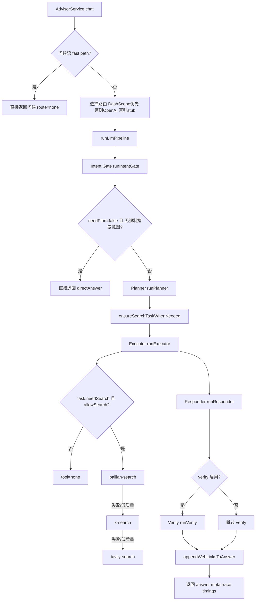

# Agentloop 结构梳理（当前实现）

## 目标

梳理 `services/api/src/modules/advisor` 下当前 agentloop 的真实执行链路，方便快速定位“卡在哪一层、为什么结果不对、延迟高在哪里”。

## 主流程（从入口到返回）

## 分层说明

- **入口层**：`advisor.service.ts`
  - 处理问候 fast path。
  - 处理 provider 路由（`DASHSCOPE_API_KEY` 优先，其次 `OPENAI_API_KEY`）。
  - 聚合 trace 与 timings，并返回标准输出。
- **意图层**：`agent_loop/intent.agent.ts`
  - 通过 `intent.prompt.ts` 判断是否进入规划链路。
  - 若 JSON 解析失败，兜底为 `needPlan=false` 并把原文当 directAnswer。
- **规划层**：`agent_loop/planner.agent.ts`
  - 通过 `planner.prompt.ts` 产出 2-4 个任务（实际代码会 normalize，最多 4 个）。
- **执行层**：`agent_loop/executor.agent.ts`
  - 对 `needSearch=true` 的任务采用“主候选竞速 + 回退”：
    1. 主候选并行竞速：`bailian-search` 与 `tavily-search`
    2. 主候选都失败/低质量时回退：`x-search`
  - 每个工具带超时（默认 `ADVISOR_SEARCH_TOOL_TIMEOUT_MS=12000`）。
  - “可用结果”判定要求包含真实 URL（排除 `example.com` 伪链接）。
- **生成层**：`agent_loop/responder.agent.ts`
  - 基于 `Planner任务 + Executor结果 + Executor备注` 生成回答。
- **校验层**：`agent_loop/verify.agent.ts`
  - 默认开启（`ADVISOR_ENABLE_VERIFY` 非 `false` 即启用）。
  - 失败时自动回退到 responder 草稿。

## 强制分流与搜索规则

- 即使 `intent.needPlan=false`，只要命中“显式搜索/实时信息/时事核验”正则，也会强制进入 `Planner + Executor`。
- `ensureSearchTaskWhenNeeded` 会在必要时把**第一条任务**强制改为 `needSearch=true`，避免 planner 漏判导致完全不搜。

## 关键可观测点（排障优先看）

- `[advisor][final_summary_input]`：看 responder 入参是否真带了 executor 结果。
- `[advisor][verify_output]`：看 verify 是否成功，是否 fallback。
- `[advisor][stage_timing]`：看 intent/planner/executor/responder/verify 各阶段耗时。
- `[advisor][slow_request]`：超过阈值（默认 3000ms）时输出热点阶段排序。
- `[advisor][search_quality_fallback]`：标记 Bailian 低质量后是否被 X/Tavily 成功兜底。

## 当前高风险点（定位问题优先关注）

- Planner 的 `answerDraft` 实际不参与最终输出链路（最终以 responder/verify 为准）。
- Executor 查询词使用 `originalMessage`，多任务场景不按任务粒度检索，可能产生偏检索。
- 强制 `needSearch` 仅修正首任务，后续任务不自动补齐。
- 时事/实时关键词正则可能偏激进，易把简单问答推入重链路，增加时延和外部依赖。

## 问题定位手册（现象 -> 日志 -> 原因 -> 修复）

### 1) 现象：回答明显没用到搜索结果

- 看日志：
  - `[advisor][final_summary_input]` 的 `input` 是否包含 `Executor执行结果` 的关键片段。
  - `[advisor][verify_output]` 是否 `fallback=true`（verify 失败回退）。
- 常见原因：
  - `executor.steps` 为空或都不是 `done`。
  - 搜索命中但被 `hasUsableSearchContent` 判为低质量（无 URL 或只有 `example.com`）。
  - responder 正常生成后被 verify 重写，且未保留检索信息。
- 修复动作（优先级从低风险到高）：
  1. 临时关闭 verify：`ADVISOR_ENABLE_VERIFY=false`，验证问题是否出在 verify 层。
  2. 打印并比对 `executor.steps` 与 `responder.userPayload` 一致性。
  3. 调整可用内容判定规则（如放宽 URL 判定或增加白名单域名策略）。

### 2) 现象：明明是简单问题却走了重链路（planner/executor）

- 看日志：
  - `trace.intent.needPlan` 与 `trace.intent.reason`。
  - `[advisor][stage_timing]` 中 `forcePlanForSearch` 是否为 `true`。
- 常见原因：
  - 命中“显式搜索/实时/时事”关键词正则，触发强制规划。
- 修复动作：
  1. 缩窄正则词表（先删高歧义词，如“是否/现在”等泛词）。
  2. 为强制规则增加二次条件（例如长度门槛、上下文意图判定）。
  3. 对误判 query 建回归测试，防止再次放大。

### 3) 现象：耗时高、响应慢

- 看日志：
  - `[advisor][stage_timing]`：定位最慢 stage。
  - `[advisor][slow_request]`：查看 `topStages` 与占比。
- 常见原因：
  - 多次 LLM 串行调用（intent + planner + responder + verify）。
  - 搜索工具超时（默认 12s）导致 executor 长尾。
  - 强制搜索把本可直答的问题拉进完整链路。
- 修复动作：
  1. 先关闭 verify 验证时延收益。
  2. 降低 `ADVISOR_SEARCH_TOOL_TIMEOUT_MS`（如 12000 -> 5000）。
  3. 收紧强制搜索规则，减少不必要 executor。

### 4) 现象：多任务规划了，但搜索结果和任务不对齐

- 看日志：
  - 对比 `trace.tasks[*].title/reason` 与 `trace.executorSteps[*].inputSummary`。
- 常见原因：
  - executor 搜索 query 统一用 `originalMessage`，不是 task 级 query。
- 修复动作：
  1. 在 executor 层改为按 task 构造 query（`title + reason + originalMessage`）。
  2. 保留降级策略：task query 失败时再回退 originalMessage。
  3. 增加多任务检索一致性测试。

### 5) 现象：计划里任务 needSearch=false，导致没有搜

- 看日志：
  - `trace.tasks` 中是否只有第一条被自动改成 `needSearch=true`。
- 常见原因：
  - `ensureSearchTaskWhenNeeded` 目前仅修正首任务。
- 修复动作：
  1. 将“自动修正”扩展为可配置策略（仅首条 / 全部候选任务）。
  2. 对“实时信息类问题”启用更激进修正（至少两条任务可搜）。
  3. 加回归测试覆盖 planner 漏标场景。

## 快速排障顺序（建议执行）

1. 先看 `[advisor][stage_timing]` 判断是慢、错、还是漏信息。
2. 再看 `[advisor][final_summary_input]`，确认 responder 是否拿到 executor 结果。
3. 看 `[advisor][verify_output]` 判断是否 verify 改写/回退。
4. 看 `[advisor][search_quality_fallback]` 判断是否搜索质量问题而非模型问题。
5. 最后再改规则：先配环境开关验证，再改代码逻辑。

## 相关文件索引

- `services/api/src/modules/advisor/advisor.service.ts`
- `services/api/src/modules/advisor/chat_completions.ts`
- `services/api/src/modules/advisor/agent_loop/intent.agent.ts`
- `services/api/src/modules/advisor/agent_loop/planner.agent.ts`
- `services/api/src/modules/advisor/agent_loop/executor.agent.ts`
- `services/api/src/modules/advisor/agent_loop/responder.agent.ts`
- `services/api/src/modules/advisor/agent_loop/verify.agent.ts`
- `services/api/src/modules/advisor/agent_loop/responder.context.ts`

## 与 `/Users/tangqianye/Downloads/src` 的 AgentLoop 差异对比（重构前分析）

> 说明：`Downloads/src` 的能力是“通用 Agent 运行时循环 + 任务编排框架”，而当前 `advisor` 是“单请求内的业务流水线”。二者定位不同，但在稳定性、可观测性、可恢复性上可直接借鉴。

### 差异 1：循环模型（一次性流水线 vs 持续事件循环）

- **当前 `advisor`**
  - `chat()` 内一次性执行 `intent -> planner -> executor -> responder -> verify`，请求返回即结束。
  - 没有“下一轮继续处理”的内建机制，也没有等待外部消息后继续的 loop。
- **`Downloads/src`**
  - `runAgent()` 驱动 query 迭代，支持多 turn（含 `maxTurns` 约束）。
  - `inProcessRunner` 存在显式 `while` 循环，可进入 idle，等待新消息/关停请求后继续执行。
- **影响**
  - 当前实现在“长任务、多轮澄清、异步回执”场景下扩展成本高，容易把所有逻辑堆到单次请求内。

### 差异 2：状态机完备度（阶段日志 vs 显式任务生命周期）

- **当前 `advisor`**
  - 以 trace/timing 描述阶段结果，但缺少统一任务状态机（如 running/idle/completed/failed/killed）。
  - 中断/取消主要依赖请求结束，不支持细粒度“只中断当前工作轮次”。
- **`Downloads/src`**
  - 任务状态完整：`running`、`isIdle`、`completed`、`failed`、`killed`，并有清理与通知闭环。
  - 区分“生命周期 abort”和“当前工作 abort”（例如只停止当前 turn，保留 agent 存活）。
- **影响**
  - 当前排障可见“慢/错”，但难精确回答“卡在运行态还是等待态”“是否可安全恢复继续”。

### 差异 3：执行恢复与连续上下文（弱恢复 vs 强恢复）

- **当前 `advisor`**
  - 单请求内临时上下文，完成后不保留可恢复运行态。
  - planner/executor/responder 的上下文拼接较轻，主要用于本次回答生成。
- **`Downloads/src`**
  - 维护跨轮消息缓冲、sidechain transcript、元数据写入（含 agent 类型、工作目录等）。
  - 支持 foreground -> background 平滑切换、以及后续 resume/继续消费。
- **影响**
  - 当前遇到超时或外部依赖波动时，常见策略是整链路重跑，缺乏“从中间状态续跑”能力。

### 差异 4：工具调度策略（固定串并混合回退 vs 通用工具生态）

- **当前 `advisor`**
  - executor 以搜索工具为中心，策略固定（Bailian/Tavily 竞速 + X 回退），query 主要是 `originalMessage`。
  - 任务级工具规划能力弱（task 粒度 query、工具权限上下文、动态工具集较弱）。
- **`Downloads/src`**
  - `runAgent` 依赖统一工具池与权限模型，支持按 agent 定义裁剪工具、MCP 扩展、前后台一致执行。
  - 可在同一 loop 中持续工具调用与消息推进，而非单阶段工具调用后立即收束。
- **影响**
  - 当前多任务检索对齐问题（task 与检索结果错位）会反复出现，且较难通过执行框架层彻底兜底。

### 差异 5：容错与资源清理（业务兜底为主 vs 运行时兜底为主）

- **当前 `advisor`**
  - 重点在业务兜底：intent parse fallback、verify fallback、搜索工具 fallback。
  - 资源级清理和运行时防泄漏（会话钩子、后台任务、上下文缓存）能力较少。
- **`Downloads/src`**
  - 强调运行时 finally 清理：MCP cleanup、hooks 清理、缓存释放、后台任务回收、通知收口。
  - 错误分层更细：abort/killed/failed 分别处理并带不同终态通知。
- **影响**
  - 当前在复杂并发或未来引入后台执行后，可能出现“逻辑成功但运行时状态脏”的隐性问题。

### 差异 6：可观测性粒度（阶段耗时 vs 生命周期+进度流）

- **当前 `advisor`**
  - 已有阶段级 timing 与关键输入输出日志，适合单请求排障。
- **`Downloads/src`**
  - 在生命周期之外，提供工具调用计数、token 增量、活动摘要、任务通知事件等流式观测。
- **影响**
  - 当前能看“最终为什么慢”，但不易做“执行中监控与预警”，也不易做中途干预。

## 对“顾问 AgentLoop 处理问题”的重构启发（仅方案，不落代码）

### 可直接借鉴的能力

- 引入 **轻量任务状态机**：至少 `running / waiting / completed / failed / aborted`。
- 将 `executor` 从“单次阶段”升级为 **可迭代执行单元**：每轮执行后可决定继续/结束。
- 把 `task.query` 显式化，改为 **task 粒度检索输入**，保留原始消息作为回退。
- 增加 **终态通知与恢复点**：记录当前任务索引、已完成步骤、失败原因，支持续跑。
- 保留现有业务优势（verify、搜索质量回退），但挂到统一循环控制之下。

### 建议的重构分层（避免一次性大改）

- **阶段 A（低风险）**：先补状态机与结构化事件，不改现有业务决策。
- **阶段 B（中风险）**：executor 改为 task 粒度迭代循环，支持每任务独立 query 与结果聚合。
- **阶段 C（中高风险）**：增加可恢复执行上下文（checkpoint），支持失败后续跑而非整链重跑。
- **阶段 D（高收益）**：按需引入后台执行/异步通知模型，解决长任务阻塞与多轮协作问题。

## 结论（本次对比产出）

- 当前 `advisor` 适合“单轮问答 + 轻规划 + 检索增强”，实现简洁、业务闭环清晰。
- `Downloads/src` 的核心优势在“运行时工程能力”（持续 loop、状态机、恢复、清理、前后台一体）。
- 若目标是解决“顾问 AgentLoop 处理问题”的稳定性与可扩展性，建议优先迁移运行时能力，再逐步迁移业务策略，不建议一次性推倒重写。

## 重构验收标准（可量化）

### 1) 功能正确性（必须达标）

- Loop 终态可判定：每次请求/任务都能落在 `completed / failed / aborted` 之一，禁止“未知中间态”泄漏到外层。
- 任务执行一致性：多任务场景下，`task.query` 与对应 `executorStep` 一一可追踪，错配率目标为 `0`（基于测试样本）。
- 结果可用性：当有有效搜索结果时，最终回答需引用到对应结果片段或链接（通过集成测试断言）。
- 回退稳定性：`verify` 失败、工具失败、解析失败三类回退路径均可命中且不抛未处理异常。

### 2) 性能与时延（建议目标）

- P50 总时延不高于当前基线 + `10%`。
- P95 总时延不高于当前基线 + `20%`（阶段 A/B 完成后评估）。
- 长尾控制：单工具超时后的额外拖尾不超过配置超时值 + `1s` 框架开销。

### 3) 可观测性（上线门槛）

- 每次执行必须产出统一结构化 trace：包含 `runId`、阶段、任务索引、终态、失败原因。
- 关键事件覆盖率：`loop_start`、`task_start`、`task_done`、`task_failed`、`loop_end` 全部可检索。
- 支持按 `runId` 一键还原执行轨迹（日志字段齐全，不依赖人工拼接）。

### 4) 可恢复性（阶段 C 门槛）

- 中断后可从 checkpoint 续跑（至少支持从“任务边界”恢复）。
- 恢复后不得重复执行已标记完成的任务（幂等保障）。
- 恢复流程在无人工介入情况下可完成主路径（自动恢复成功率目标 `>= 95%`）。

## 里程碑排期（建议按周）

### Week 1：阶段 A（状态机与观测打底）

- 输出统一状态机定义与事件模型（文档 + 类型定义）。
- 在不改业务决策前提下接入结构化事件与 `runId` 链路。
- 完成最小回归测试：直答链路、规划链路、失败链路。
- 里程碑产出：可观测性达标，功能行为与当前一致。

### Week 2：阶段 B（executor 任务级循环）

- executor 改为 task 粒度迭代；引入 `task.query` 构造策略与回退策略。
- 完成多任务对齐测试与搜索回退测试（Bailian/Tavily/X）。
- 对比基线时延，调优超时参数与并发策略。
- 里程碑产出：多任务检索错配问题可控，主流程稳定。

### Week 3：阶段 C（恢复点与续跑）

- 增加 checkpoint（建议任务边界粒度）。
- 实现失败后续跑能力与幂等保护（避免重复执行完成任务）。
- 增加中断恢复测试、故障注入测试（工具超时/LLM 失败/verify 失败）。
- 里程碑产出：长任务可恢复，故障成本下降。

### Week 4：阶段 D（可选：后台化与通知）

- 触发条件：仅当业务确认存在“单次请求超时风险高、需要异步继续执行/通知”的场景时开启。
- 评估并接入后台执行模型（仅在业务需要时开启）。
- 增加终态通知与进度上报（与现有 trace 对齐）。
- 补齐运维文档与开关策略（灰度、回滚、降级）。
- 里程碑产出：长任务体验优化，主链路可灰度发布。

## 每阶段发布闸门（Go/No-Go）

- 测试闸门：新增测试通过率 `100%`，历史关键回归用例无新增失败。
- 观测闸门：核心事件缺失率为 `0`，可按 `runId` 完整追踪。
- 性能闸门：P95 超基线阈值即 No-Go，先回滚配置/策略再继续。
- 运营闸门：保留环境开关（`ADVISOR_*`）用于快速降级，不允许“无开关硬切”上线。

## 指标统计口径（执行前统一）

- 时延指标口径：按生产环境同一发布版本统计，窗口建议为 `24h` 滚动窗口。
- 分位数样本口径：仅统计有效请求（剔除参数非法与主动取消请求），样本量建议 `>= 1000` 后再做阶段性判定。
- 基线对比口径：以重构前一稳定版本同时间段指标为基线，使用同一筛选条件对比 P50/P95。
